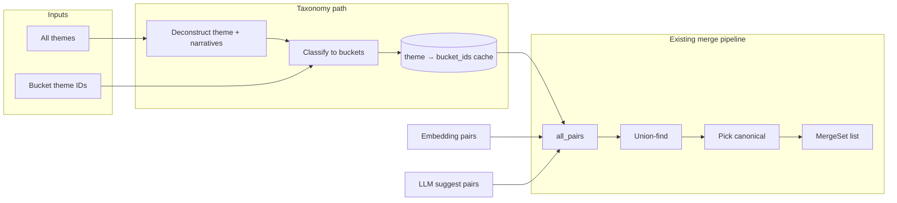

# Taxonomy logic in existing “merge themes” flow (revised plan)

**Goal:** Reuse Gemini’s “taxonomy-first” idea (ontology + deconstruct + classify) **only** inside the existing on-demand **merge themes** flow. No new “megatheme” concept, no new timeline strategy, no new user-facing concepts.

---

## Current merge flow

- **GET /admin/themes/suggest-merges** (dry run): [`compute_merge_candidates(db, options)`](backend/app/theme_merge.py) returns a list of `MergeSet(theme_ids, canonical_theme_id, labels)`.  
  Sources today: (A) label embedding similarity, (B) content embedding similarity, (C) optional LLM `suggest_theme_merge_groups` (free-form “which labels refer to the same theme?”). Pairs from A/B/C are deduped, filtered for entity conflict, union-find’d into sets; for each set with ≥2 themes a canonical theme is chosen (e.g. by volume).
- **POST /admin/themes/merge**: Executes merge (source → target; move narratives, delete source). No change.

---

## Integration: taxonomy as another source of merge candidates

Add a **fourth** source of pairs (and optionally merge sets) inside `compute_merge_candidates`, gated by a new option (e.g. `use_taxonomy=True`).

### 1. Ontology = “bucket” themes (existing themes only)

- **Bucket themes** = the taxonomy. No new table.
- **Source of bucket list:** Either:
  - **Root themes:** themes with `parent_theme_id IS NULL`, or  
  - **Explicit list:** query param or option, e.g. `taxonomy_bucket_theme_ids=1,2,5` (theme IDs that are the canonical “market” buckets, e.g. Iran, CPO Technology).
- API: e.g. `use_taxonomy=true` and optional `taxonomy_bucket_theme_ids=1,2,3` on GET suggest-merges. If `taxonomy_bucket_theme_ids` is omitted, use root themes as buckets.

### 2. Deconstruct + classify (same LLM idea, different use)

- **Input per theme:** `canonical_label` + 1–3 recent `Narrative.statement` (from DB), same pattern as narrative summary / content embedding.
- **Step 1 (deconstruct):** One LLM call (or batched): “Given this theme and sample narratives, identify primary geopolitical actor (if any), primary asset/sector, and a one-sentence market driver.” Output: structured (actor, asset_class, driver_sentence).
- **Step 2 (classify):** “Given this driver and the following market buckets (list of bucket theme labels), which bucket(s) does this theme belong to? Return **all** that apply (list of bucket labels).”
- **Output:** For each theme, list of bucket **theme IDs** (one or more). Prefer **primary bucket** when forming merge pairs (see below).

### 3. How taxonomy feeds into merge candidates

- For each theme T with at least one bucket B (existing theme_id in our DB):
  - Add **pairs** `(T, B)` for each bucket B that T classified to (or only for the **primary** bucket — see “Primary vs multiple buckets” below).
- Append these pairs to the same `all_pairs` list used by embedding and LLM. Then:
  - Existing dedupe, entity-conflict filter, and union-find run as today.
  - Result: themes that map to the same bucket (e.g. “Hormuz Strait” and “Iran energy” both → Iran) end up in the same set, with the bucket theme (Iran) in that set; `_pick_canonical` can choose the bucket theme as canonical when it’s in the set (e.g. by preferring a theme that is in the bucket list, or by volume).
- **No new response shape:** still `SuggestMergesOut` with the same `MergeSet` list. Taxonomy only adds more pairs/sets; UI stays “Dry run → see groups → Merge.”

### 4. Primary vs multiple buckets (for merge)

- **Option A — Primary bucket only:** Each theme T contributes one pair `(T, primary_bucket_id)`. So each theme appears in at most one suggested merge group; canonical = that bucket theme. Simple and clear for “merge into Iran.”
- **Option B — All buckets:** T maps to [Iran, Energy]; add (T, Iran) and (T, Energy). Union-find then merges Iran and Energy into one set with T, so one big group with one canonical. That may or may not be desired.
- **Recommendation:** Use **primary bucket only** for merge suggestions (e.g. first bucket in the list, or the one the LLM marks as primary). Store “all buckets” in cache for possible future use (e.g. “suggest parent” = set parent_theme_id to one of the buckets without merging).

### 5. Caching (optional but recommended)

- **Purpose:** Avoid re-calling the LLM on every dry run.
- **Schema:** Small table or in-memory cache: `theme_id` → `[bucket_theme_id, ...]` (+ optional `driver_json`, `computed_at`). TTL e.g. 7 days; optionally invalidate when theme’s narratives change (e.g. new evidence).
- **Flow:** When `use_taxonomy=True`, for each theme check cache; on cache miss (or stale), run deconstruct + classify and write cache. Then form pairs from cached bucket list (primary or all, per choice above).

### 6. Code touchpoints

| Where | Change |
|-------|--------|
| [`MergeOptions`](backend/app/theme_merge.py) | Add `use_taxonomy: bool = False`, optional `taxonomy_bucket_theme_ids: list[int] \| None = None`. |
| `compute_merge_candidates()` | If `opts.use_taxonomy`, (1) resolve bucket theme list (param or roots), (2) for each theme get bucket_theme_ids (from cache or LLM), (3) add pairs (theme_id, bucket_theme_id) for primary bucket (or all), (4) append to `all_pairs`. Rest unchanged. |
| New module or functions | e.g. `app/llm/theme_taxonomy.py`: `get_bucket_theme_ids_for_theme(db, theme_id, bucket_theme_ids, narratives_sample_size=3)` → `list[int]`; optional `_build_deconstruct_prompt`, `_build_classify_prompt`, batch LLM call. |
| [GET suggest-merges](backend/app/main.py) | Add query params `use_taxonomy: bool = False`, `taxonomy_bucket_theme_ids: Optional[str]` (comma-separated IDs). Pass into `MergeOptions`. |
| Admin UI | Optional: checkbox “Use taxonomy (deconstruct + classify to bucket themes)” and optional text input for bucket theme IDs. Same “Dry run” and “Merge” buttons. |

### 7. Narratives can belong to multiple themes/buckets

- **At theme level:** Classify returns **all** buckets that apply; for **merge** we use primary bucket only so each theme still lands in one merge group. Cache can still store full list for future “suggest parent” or grouping.
- **At narrative level (later):** If we add narrative-level classification, a theme could be suggested to merge into bucket A from narrative set 1 and into bucket B from narrative set 2; for merge we’d still need a single canonical suggestion (e.g. primary bucket by narrative count or one chosen bucket). So Phase 1 = theme → buckets; Phase 2 (optional) = narrative → buckets, then derive one primary “merge target” per theme from narrative buckets.

---

## What we do **not** add

- No new “megatheme” API or timeline strategy.
- No change to timeline viz or `theme_clusters.py` for this scope.
- No new user-facing concept; only an extra way to **generate** the same suggest-merges output.

---

## Data flow (taxonomy inside merge)

This keeps the taxonomy logic entirely inside the on-demand “merge themes” flow and reuses the existing merge UX and APIs.
